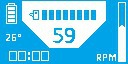

# embedded_system

# ECU1 schematic

# Lista de compras

* 3x baterias recarregáveis 9v
* 4x sensores infrared para AV
* 2x luz de freio
* conduítes diversos
* fios diversos
* placas universais diversas
* 2x kill switch
* 2x chaves pro painel do carro
* chaves on/off
* jacks
* conector automotivo
* 1x sensor indutivo
* 1x sensor capacitivo
* 5m termoretrátil
* 1x esp32