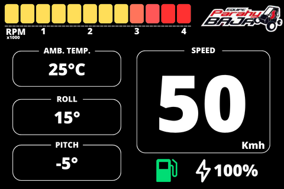
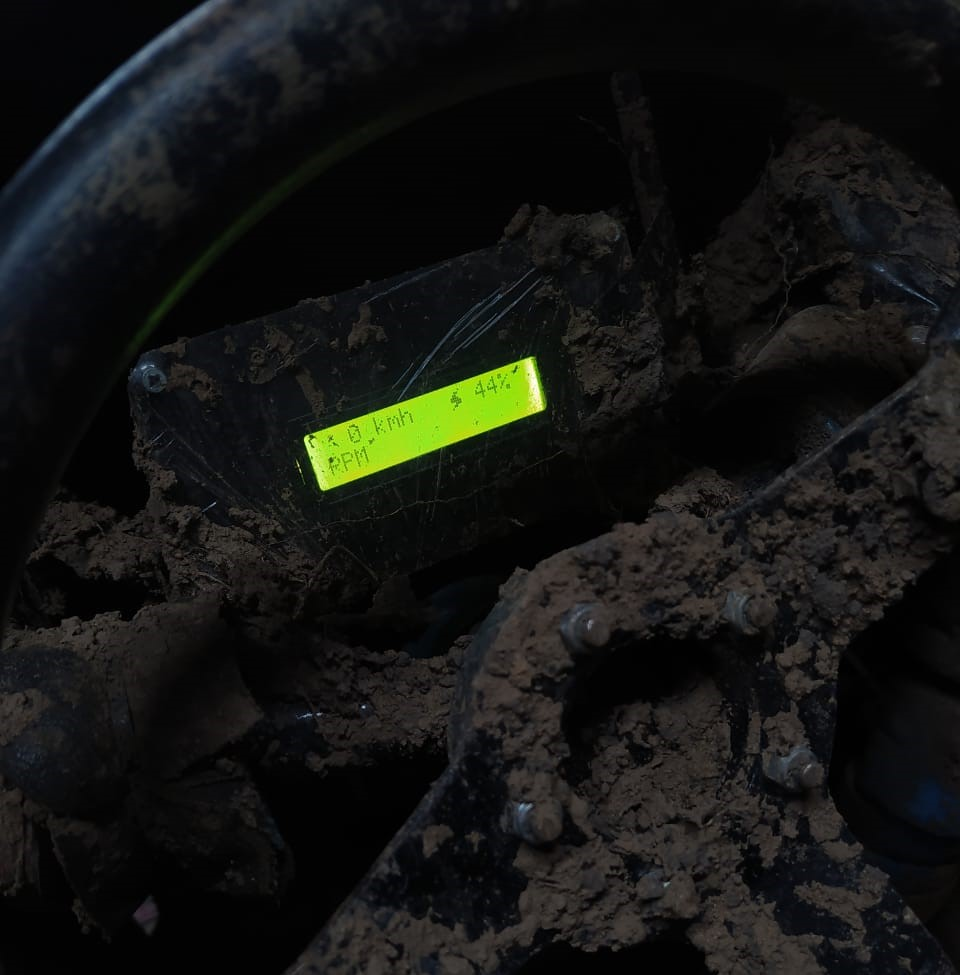
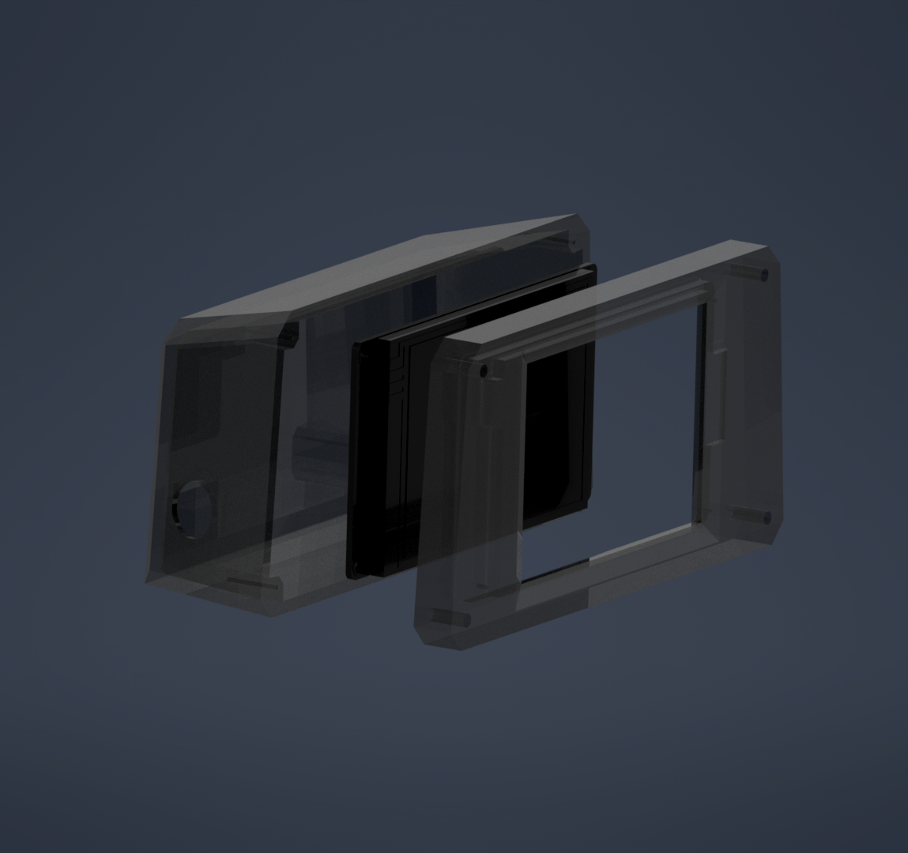
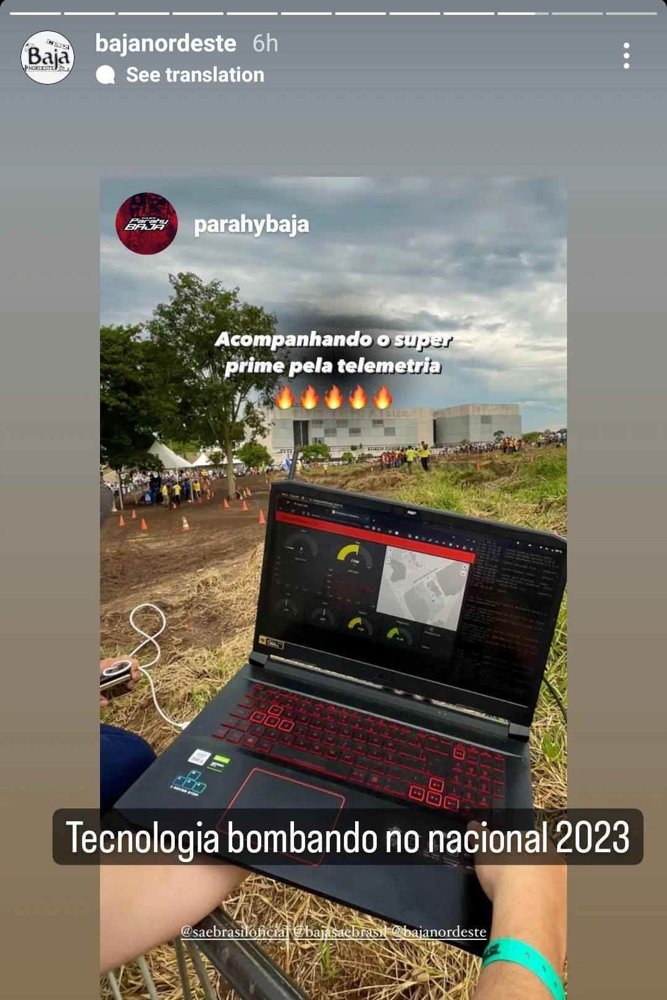
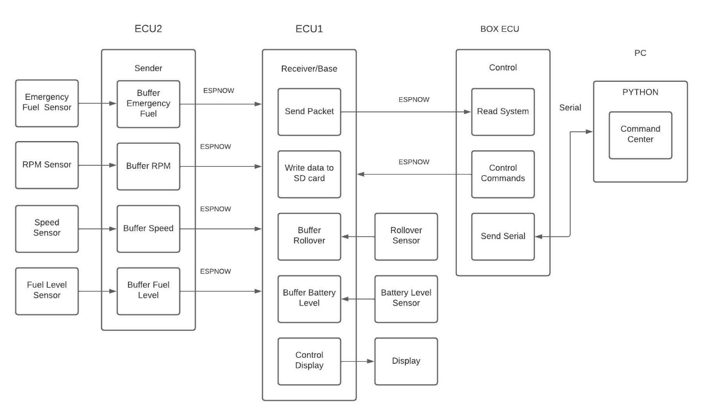

# Firmware v5

<p align="middle">
    
    
</p>

<p align="middle">
    
    
</p>

# Embedded system workflow



# System requirements

* VS code ESP-IDF extension
* ESP-IDF v5.1.2

# Bug fixes

## vs code config folder

If there are no config files in /.vscode folder or there's only one file, delete the /.vscode folder and use the following command to create the new config folder properly:

```
Crtl + Shift + P
```
```
ESP-IDF: Add .vscode Configuration Folde
```

## code highlighting

Add this following line to **.vscode/c_cpp_properties.json** before **"includePath"**

```
"compileCommands": "${workspaceFolder}/build/compile_commands.json",
```

## flashing error

Run the following commands on the terminal to give the user permission to access the USB device:

```
sudo adduser <username> dialout
```
and

```
sudo chmod a+rw /dev/ttyUSB*
```
